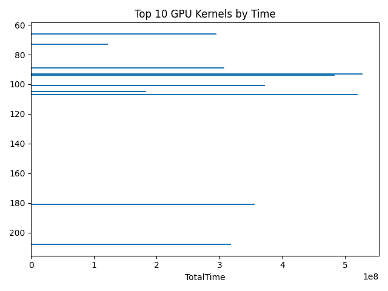

# Training Profiler with Nsight Systems (Windows)
[](LICENSE)

This repo provides a **minimal PyTorch training loop** instrumented with **NVTX ranges**, plus **one-click profiling** using **NVIDIA Nsight Systems**. It automatically exports **kernel/API summaries** (CSV), a **Top-10 kernels chart**, and a ready-to-paste **README snippet** for reports or PRs.

> Windows-first. Works great on Windows 11 with CUDA-enabled PyTorch and Nsight Systems 2025.x. (Linux/mac users can adapt the commands.)

---

## Features

- ✅ One-click run: `scripts/run_all.bat` cleans old results, profiles with Nsight Systems, exports CSVs, and renders a chart.
- ✅ NVTX annotations in the training loop (`src/train.py`): `dataloader_setup`, `batch_to_device`, `forward`, `backward`, `optimizer_step`, `epoch_x`.
- ✅ Robust export flow for **Nsight versions that emit `.nsys-rep`** (Windows): exports a **SQLite DB**, then derives CSVs/plots from it.
- ✅ Works without system-wide PATH tweaks (scripts can call `nsys.exe` via a full path).
- ✅ Windows-friendly scripts (no heredocs; UTF-8/ASCII safe).

---

## Repo Layout
<details>
  <summary><b>Repo layout</b></summary>

```text
training-profiler-nsight/
├─ src/
│  ├─ model.py
│  └─ train.py
├─ scripts/
│  ├─ run_all.bat
│  ├─ profile_nsys.bat
│  ├─ export_nsys_csv.bat
│  ├─ extract_from_sqlite.py
│  ├─ plot_top10.py
│  ├─ gen_readme_snippet.py
│  └─ clean_results.bat
├─ results/
│  ├─ nsys_report.nsys-rep
│  ├─ nsys_report.sqlite
│  └─ nsys_csv/
│     ├─ gpukernsum.csv
│     ├─ cudaapisum.csv
│     ├─ top10_kernels.png
│     └─ README_snippet.md
├─ requirements.txt
└─ README.md
```
</details>

---

## Prerequisites

- **NVIDIA GPU + driver** (GeForce/Studio). Check:
  ```powershell
  nvidia-smi
  Python 3.10+ (64-bit).
  CUDA-enabled PyTorch (cu12x or cu118 wheel):
  pip install torch torchvision torchaudio --index-url https://download.pytorch.org/whl/cu121
  Nsight Systems for Windows (tested with 2025.5.1). Verify: "C:\Program Files\NVIDIA Corporation\Nsight Systems 2025.5.1\target-windows-x64\nsys.exe" --version
  
  If nsys isn’t on PATH, the scripts call it via a full path—no global changes needed.

---
## Quick Start (Windows 11)

From the repo root in PowerShell:

# 1) Create & activate venv (first time)
python -m venv .venv
.\.venv\Scripts\Activate.ps1
python -m pip install --upgrade pip
pip install -r requirements.txt
# Install CUDA PyTorch if you haven't yet:
pip install torch torchvision torchaudio --index-url https://download.pytorch.org/whl/cu121

# 2) One-Click: Clean + Profile + Export
.\scripts\run_all.bat

What you’ll get:
   Trace: results/nsys_report.nsys-rep (open in Nsight Systems GUI)
   DB: results/nsys_report.sqlite
   CSVs: results/nsys_csv/gpukernsum.csv, results/nsys_csv/cudaapisum.csv
   Plot: results/nsys_csv/top10_kernels.png
   Snippet: results/nsys_csv/README_snippet.md (paste into this README)

If you want WDDM/CPU context-switch traces, start PowerShell as Administrator before running. Otherwise you’ll see warnings and those traces are skipped (harmless).

---

## Manual Run

# Activate venv
.\.venv\Scripts\Activate.ps1

# Profile (records .nsys-rep)
.\scripts\profile_nsys.bat

# Export: build SQLite, extract CSVs, and plot
.\scripts\export_nsys_csv.bat

Open the timeline in Nsight Systems GUI: File → Open… → results\nsys_report.nsys-rep

---

## Customizing the Workload

run_all.bat forwards extra flags to the Python training script (via profile_nsys.bat). Examples:
# Larger batch and sequence to stress kernels
.\scripts\run_all.bat --batch-size 128 --seq-len 256

# Two epochs with automatic mixed precision (AMP is on by default in the .bat)
.\scripts\run_all.bat --epochs 2

# Disable AMP (edit the profile script or pass a flag if your train.py supports it)
The training loop accepts:
--epochs
--batch-size
--seq-len
--d-model
--layers

---

## How It Works

src/train.py is a small Transformer-style model using NVTX ranges for the major phases.

profile_nsys.bat runs: nsys profile --trace=cuda,nvtx,cublas,wddm -o results\nsys_report python -u src\train.py ...

(Some Nsight versions require cuDNN capitalization; the script uses a compatible set.)

export_nsys_csv.bat calls nsys stats to create nsys_report.sqlite, then
scripts/extract_from_sqlite.py queries kernels & CUDA APIs tables (schema-agnostic) and
scripts/plot_top10.py renders a simple bar chart.

This flow is resilient across Windows Nsight releases that generate .nsys-rep and do not support --type=qdrep/--type=csv.

---

## Sample Results

## Nsight Systems profile - top kernels



| # | Kernel | Total Time (arb) |
|---:|---|---:|
| 1 | `93` | 527645590 |
| 2 | `107` | 520464354 |
| 3 | `94` | 483739977 |
| 4 | `101` | 372325631 |
| 5 | `181` | 355743757 |
| 6 | `208` | 318446283 |
| 7 | `89` | 307545127 |
| 8 | `66` | 295595624 |
| 9 | `105` | 183200866 |
| 10 | `73` | 122692034 |

---

## Troubleshooting (Quick)

CUDA available: False in Python
You installed a CPU-only PyTorch. Reinstall a CUDA wheel (cu121/124/118) and confirm nvidia-smi works.

nsys not recognized
Keep the scripts’ full path to nsys.exe, or add its folder to PATH for the session: $env:Path += ';C:\Program Files\NVIDIA Corporation\Nsight Systems 2025.5.1\target-windows-x64'

Illegal --trace value osrt
That domain is Linux-only. The Windows script uses cuda,nvtx,cublas,wddm (and optional cuDNN with correct case).

No .qdrep created
On Windows, Nsight often emits .nsys-rep. Open it directly in the GUI; our exporter uses SQLite to derive CSVs.

Admin warnings about WDDM/CPU sampling
Start PowerShell “Run as administrator” to enable those traces, or ignore the warnings.

---

## Git Tips

Suggested .gitignore keeps large artifacts out of the repo:

__pycache__/
*.pyc
.venv/
.env/
results/*.nsys-rep
results/*.qdrep
results/*.sqlite
results/_stats_*.txt

Commit the CSVs and PNGs, not the large traces. Example:

git add README.md scripts src requirements.txt
git add results\nsys_csv\*.csv results\nsys_csv\top10_kernels.png
git commit -m "Nsight profile: CSVs + plot + scripts"

---

## License

This project is licensed under the MIT License — see the [LICENSE](LICENSE) file for details.

---

## Acknowledgements

NVIDIA Nsight Systems

PyTorch team and contributors


---

## Troubleshooting

### CUDA is not used (`Using device: cpu` / `CUDA available: False`)
- Make sure `nvidia-smi` works (driver installed).
- Install a CUDA wheel:  
  `pip install torch torchvision torchaudio --index-url https://download.pytorch.org/whl/cu121`
- Ensure your venv is active when you run (`.\.venv\Scripts\Activate.ps1`).

### `nsys` not recognized
- Use the full path shown by your installation, e.g.:  
  `"C:\Program Files\NVIDIA Corporation\Nsight Systems 2025.5.1\target-windows-x64\nsys.exe"`
- Or add it to PATH for the current session:  
  `$env:Path += ';C:\Program Files\NVIDIA Corporation\Nsight Systems 2025.5.1\target-windows-x64'`

### `Illegal --trace argument 'osrt'`
- `osrt` is Linux. Use `cuda,nvtx,cublas,wddm` on Windows. `cuDNN` is optional and case-sensitive (`cuDNN`).

### Admin warnings: WDDM/context switches/CPU sampling disabled
- Run PowerShell **as Administrator** to enable them. Otherwise ignore.

### No `.qdrep` file, only `.nsys-rep`
- Windows Nsight often produces `.nsys-rep`. Open it directly in the GUI.
- Our exporter uses `nsys stats` to create `results/nsys_report.sqlite`, then extracts CSVs.

### `nsys export --type=csv|qdrep` unsupported
- Expected on some Windows builds. Use the provided exporter (SQLite + Python).

### CSV has a “Generating SQLite file …” line instead of data
- You redirected the wrong output. Re-run:

nsys stats results\nsys_report.nsys-rep
python scripts\extract_from_sqlite.py results\nsys_report.sqlite results\nsys_csv

### Batch file encoding prompts / garbled characters
- Save `.bat` files as **UTF-8** or **ANSI** and keep them ASCII-only (the repo scripts are).

### PowerShell heredoc errors with `python - <<PY`
- That’s a bash syntax. Use `python -c "..."` or a separate `.py` file in PowerShell.

---

## FAQ

**What does “perf” mean?**  
Short for **performance**—typically throughput/latency, utilization, or time-to-train.

**Why NVTX?**  
NVTX ranges label phases (forward/backward/optimizer), so Nsight timelines are readable and you can correlate kernels with model code.

**Can I profile larger models?**  
Yes—pass bigger `--batch-size`, `--seq-len`, `--d-model`, `--layers` to stress kernels, then re-run `scripts/run_all.bat`.

**Where do I see the full timeline?**  
Open `results/nsys_report.nsys-rep` in **Nsight Systems** GUI.

**How do I keep prior results?**  
Run `scripts/run_all.bat noclean` to skip the cleanup step.

**How do I add Nsight Compute?**  
You can add a `scripts/profile_ncu.bat` later to capture kernel metrics; it’s not required for this repo.